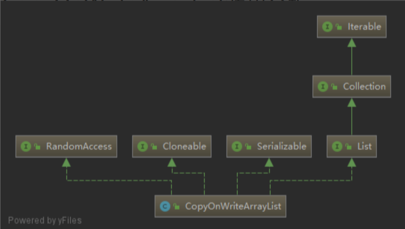

# 基本介绍

CopyOnWriteArrayList是ArrayList的线程安全版本，内部也是通过数组实现，每次对数组的修改都完全拷贝一份新的数组来修改，这样保证了只阻塞写操作，不阻塞读操作，实现读写分离。

### 继承体系



>CopyOnWriteArrayList实现了List, RandomAccess, Cloneable, java.io.Serializable等接口。
>
>CopyOnWriteArrayList实现了List，提供了基础的添加、删除、遍历等操作。
>
>CopyOnWriteArrayList实现了RandomAccess，提供了随机访问的能力。
>
>CopyOnWriteArrayList实现了Cloneable，可以被克隆。
>
>CopyOnWriteArrayList实现了Serializable，可以被序列化。属性

### 属性
```java
/** 用于修改时加锁 */
final transient ReentrantLock lock = new ReentrantLock();
/** 真正存储元素的地方，只能通过getArray()/setArray()访问 */
private transient volatile Object[] array;
```
（1）lock
		用于修改时加锁，使用transient修饰表示不自动序列化。
（2）array
		真正存储元素的地方，使用transient修饰表示不自动序列化，使用volatile修饰表示一个线程对这个字段的修改另外一个线程立即可见。

### CopyOnWriteArrayList()构造方法


